<h1>
  
  Draftly
</h1>

A privacy-first resume builder that runs entirely in the browser. No accounts, no servers, no data ever leaves your machine. Build, preview, and export a polished resume in minutes.

> 🔗 **Live Demo:** https://draftly-pearl.vercel.app/

## Screenshots

### Home Page

<table>
<tr>
<td>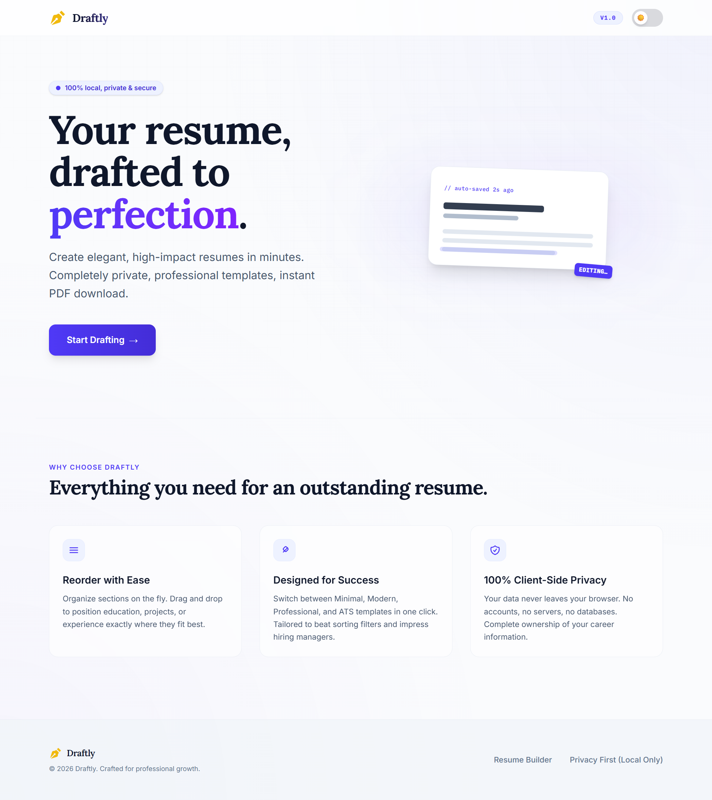</td>
<td>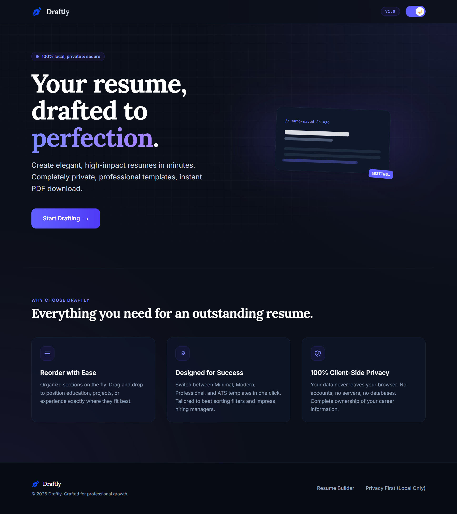</td>
</tr>
<tr>
<td align="center">Light Mode</td>
<td align="center">Dark Mode</td>
</tr>
</table>

### Builder

<table>
<tr>
<td>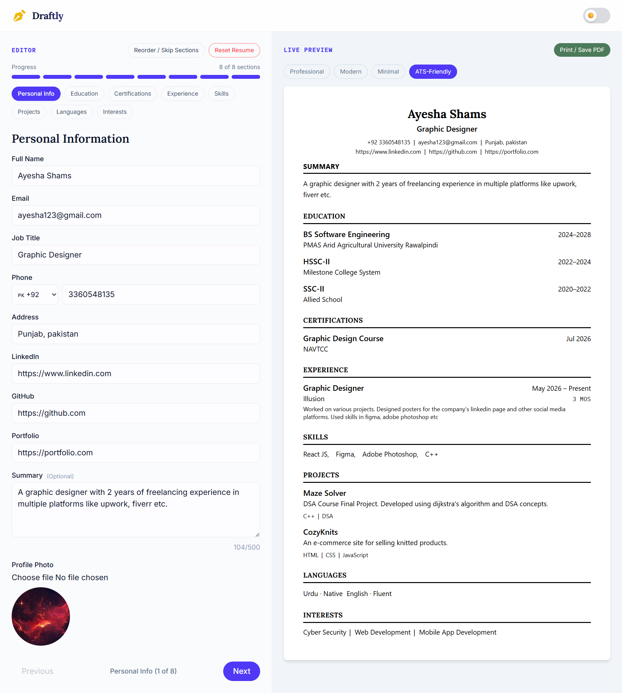</td>
<td>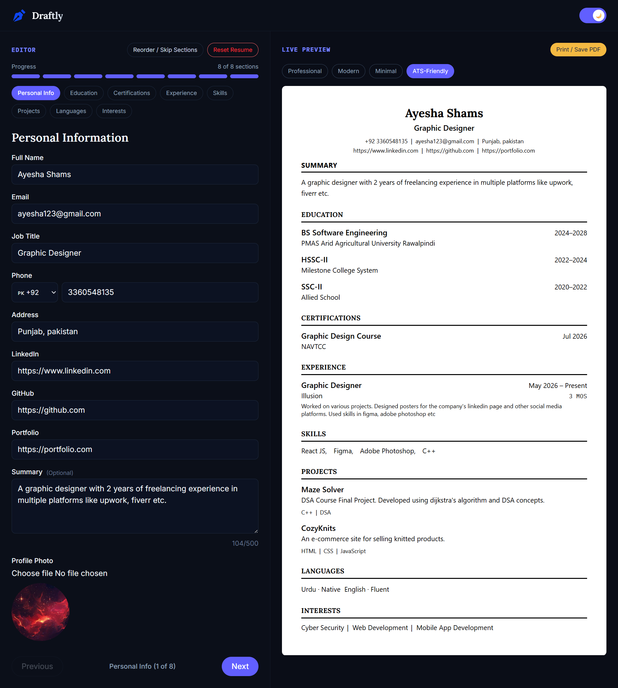</td>
</tr>
<tr>
<td align="center">Light Mode</td>
<td align="center">Dark Mode</td>
</tr>
</table>

### Section Picker

<table>
<tr>
<td>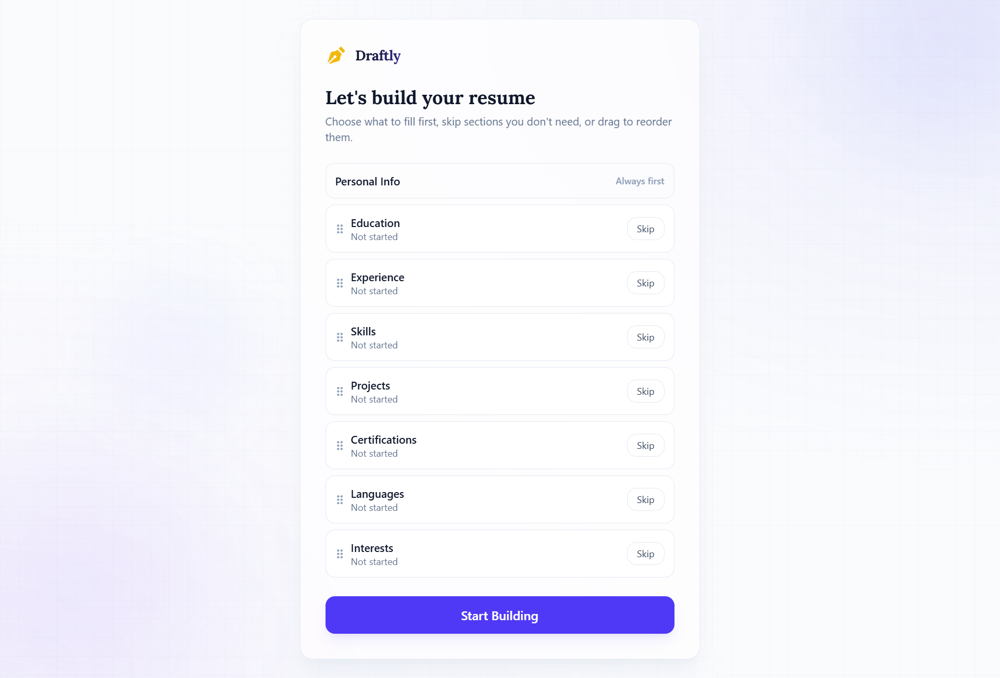</td>
<td>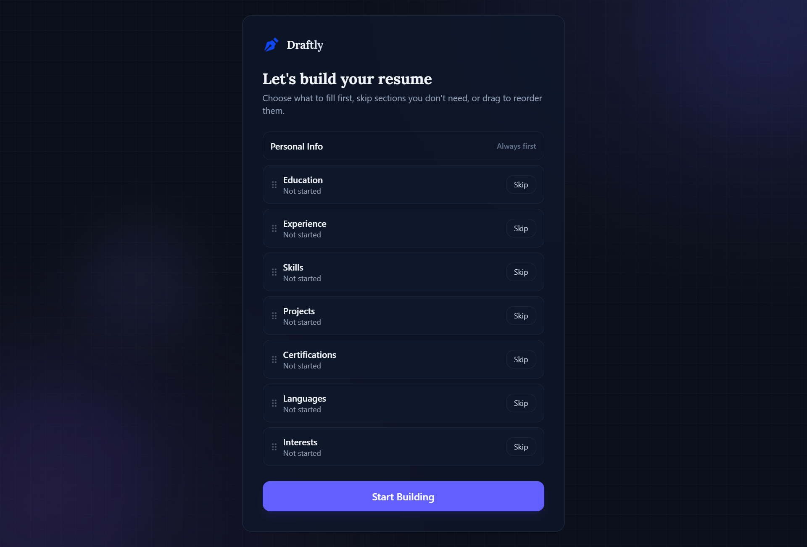</td>
</tr>
<tr>
<td align="center">Light Mode</td>
<td align="center">Dark Mode</td>
</tr>
</table>

### 404 Page

<table>
<tr>
<td>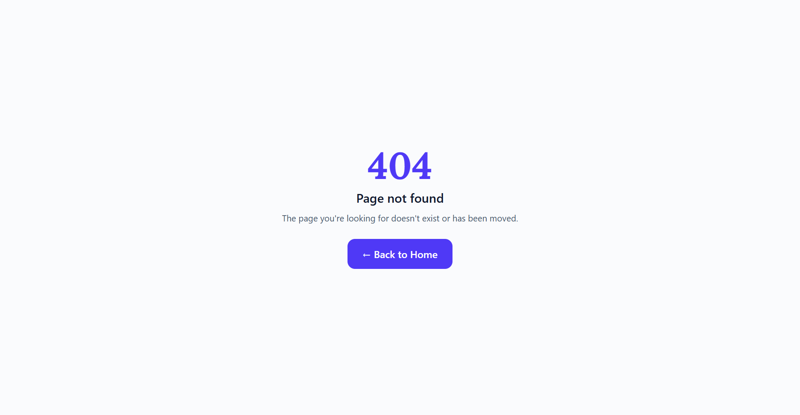</td>
<td>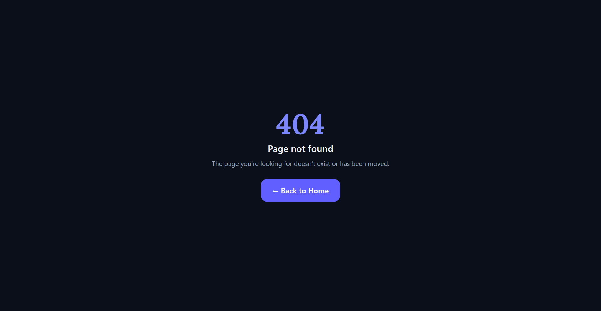</td>
</tr>
<tr>
<td align="center">Light Mode</td>
<td align="center">Dark Mode</td>
</tr>
</table>

### Templates

<table>
<tr>
<td align="center">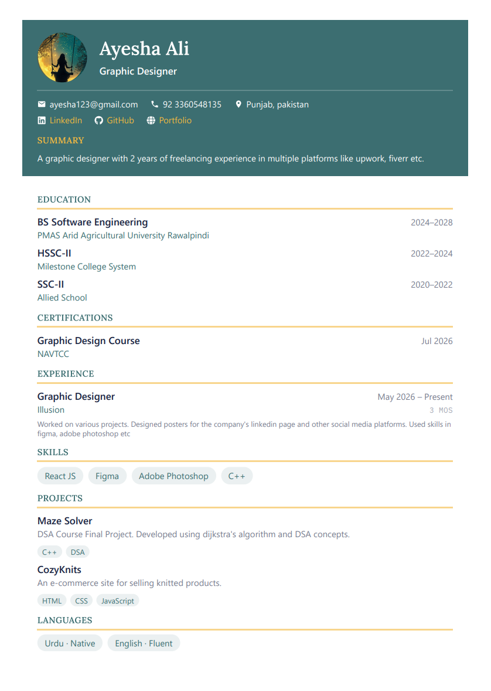<br/>Professional</td>
<td align="center">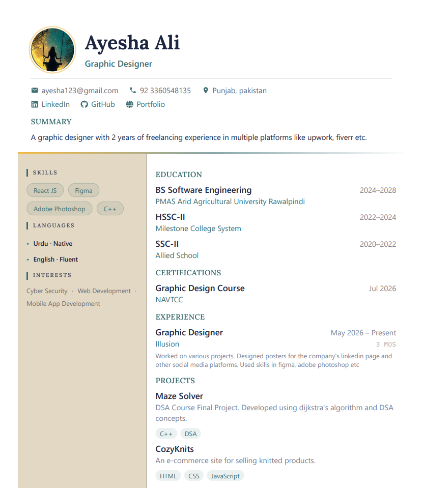<br/>Modern</td>
<td align="center">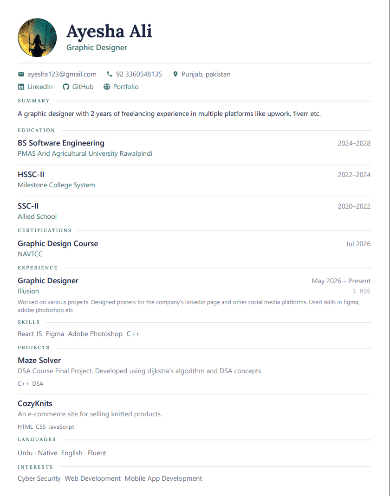<br/>Minimal</td>
<td align="center">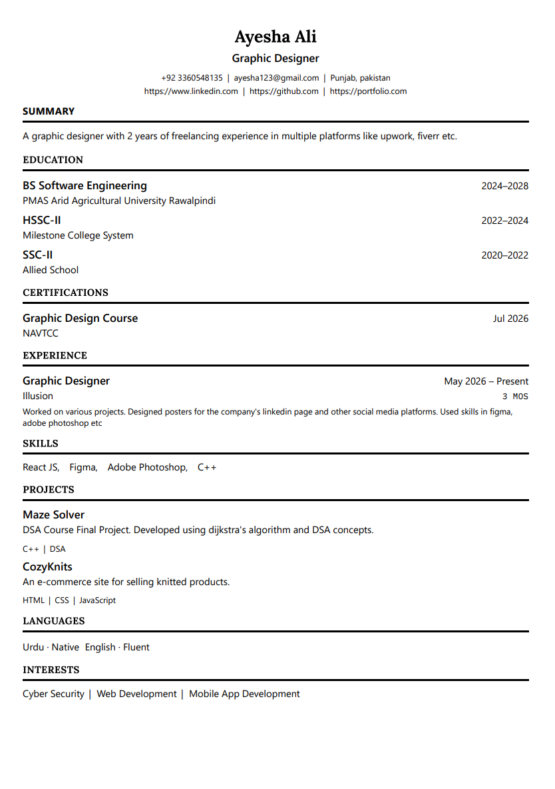<br/>ATS-Friendly</td>
</tr>
</table>

## Features

- **4 professional templates** — Professional, Modern, Minimal, and ATS-Friendly
- **Live preview** — see changes reflected instantly as you type
- **Click-to-edit** — click any section in the preview to jump straight to its form
- **Drag to reorder** — rearrange resume sections in both the editor and preview
- **Skip sections** — hide sections you don't need without losing their data
- **Section picker** — a dedicated screen (first visit) or reopenable modal to choose fill order, skip, or reorder sections, with per-section progress status
- **Swipe navigation** — swipe left/right on mobile to move between sections
- **Print / Save PDF** — exports directly via the browser print dialog, no third-party service
- **Auto-save** — all data is saved to localStorage automatically on every change
- **Dark mode** — full dark/light theme toggle with preference persistence
- **Toast notifications & confirm dialogs** — lightweight, dependency-free UI feedback for actions like resetting the resume
- **Error boundary** — the app fails gracefully with a recovery screen instead of a blank crash
- **Custom 404 page**
- **100% client-side** — nothing is sent to any server

## Tech Stack

| Tool | Purpose |
|---|---|
| React 19 | UI |
| Vite | Build tool & dev server |
| Tailwind CSS v4 | Styling |
| Formik + Yup | Form state & validation |
| dnd-kit | Drag-and-drop section reordering |
| react-datepicker | Month/year picker for dates (Education, Experience, Certifications) |
| react-to-print | PDF export via browser print |
| react-router-dom v7 | Client-side routing |
| localStorage | Persistence (no backend) |

## Getting Started

**Prerequisites:** Node.js 18+

```bash
# Install dependencies
npm install

# Start the dev server
npm run dev
```

Then open [http://localhost:5173](http://localhost:5173).

```bash
# Production build
npm run build

# Preview the production build locally
npm run preview
```

## Project Structure


## Project Structure

```text
src/
├── components/
│   ├── Builder/          # Header, main layout, edit + preview columns
│   ├── ResumeForm/       # Per-section form components (education, experience, etc.)
│   ├── ResumePreview/
│   │   ├── sections/     # Per-section preview renderers
│   │   ├── shared/       # Drag, scale, click-to-edit wrappers
│   │   └── templates/    # Professional, Modern, Minimal, ATS templates
│   ├── SectionPicker/    # Reorder / skip sections modal
│   ├── SkillInput/       # Tag-style input for skills and interests
│   ├── Toast.jsx / ConfirmDialog.jsx / ErrorBoundary.jsx  # Shared UI feedback + crash handling
│   └── ThemeToggle.jsx
├── context/
│   ├── ResumeContext.jsx      # Global resume state (useReducer + localStorage)
│   ├── BuilderNavContext.jsx  # Active section, tab, and nav logic
│   ├── ThemeContext.jsx       # Dark/light mode
│   └── ToastContext.jsx       # Global toast dispatch
├── hooks/
│   ├── useAutoEditEntry.js    # Opens an entry for edit when clicked in preview
│   ├── useLocalStorage.js     # Auto-persists state to localStorage
│   ├── useSectionDragDrop.js  # dnd-kit sensors and drag end handler
│   └── useSwipeNavigation.js  # Touch swipe → section navigation
├── pages/
│   ├── Home.jsx          # Landing page
│   ├── Builder.jsx       # Main builder page
│   └── NotFound.jsx      # 404 page
└── utils/
    ├── calculateDuration.js   # Human-readable duration from date range
    ├── constants.js           # Shared labels and proficiency levels
    ├── formatDate.js          # "YYYY-MM" → "Jan 2024"
    ├── generateID.js          # crypto.randomUUID wrapper
    ├── sectionMeta.js         # List of sections that hold multiple entries
    └── validationSchemas.js   # Yup schemas for all forms
```

## Data & Privacy

All resume data is stored exclusively in your browser's `localStorage` under the key `draftly-resume`. Clearing site data or using a different browser will clear your resume. There is no sync, no backup, and no external requests.

Because everything lives in localStorage rather than a server, this comes with a couple of natural tradeoffs:

- **No cross-device sync** — data lives in localStorage, so switching browsers or devices starts from scratch
- **localStorage cap** — browsers typically limit localStorage to ~5MB; very large profile photos encoded as base64 can hit this
- **PDF quality is browser-dependent** — print output can vary slightly between Chrome, Firefox, and Safari, since it relies on each browser's own print engine

## Possible Future Improvements

- **Undo/redo** — step back through changes instead of every edit applying immediately
- **Resume import** — load an existing resume file instead of starting from scratch
- **Direct image export** — PNG/JPG download in addition to print/Save-as-PDF
- **Cloud sync** — optional account-based backup across devices, while keeping the current local-only mode as the default